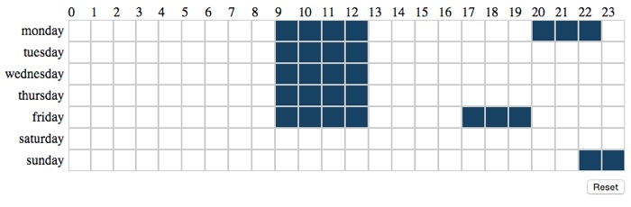

# angular dayparts

Angular directive for select hours in a week

Code based on [this StackOverflow answer](http://stackoverflow.com/questions/23163952/how-do-i-capture-table-td-elements-using-mousedown-dragselect-event)





Include module in your app

```javascript
angular.module('myapp', ['angular-dayparts'])
```


Config the directive inside the controller

```javascript
$scope.options = {
    reset: true,
    onChange: function(selected) {
        console.log('selected: ', selected)
    }
};
```


Call the directive from your page

```html
<angular-dayparts options="options"></angular-dayparts>
```


## License

Released under the terms of MIT License.